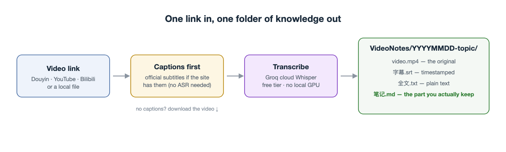

<p align="center">
  
</p>

<h1 align="center">video-notes</h1>

<p align="center">
  Drop a video link in the chat. Get back a folder with the subtitles, the full text, and a note you can actually review later.
</p>

<p align="center">
  <a href="https://skills.sh/Djcloveml/video-notes"></a>
  <a href="LICENSE"></a>
</p>

I kept saving knowledge videos on Douyin, YouTube, and Bilibili, and never rewatched any of them. This skill turns each one into a folder of text I can search and skim. A 5-minute video becomes a page I can read in 40 seconds.

## What happens when you paste a link

1. The agent picks the cheapest route for the site. On YouTube and Bilibili it grabs the official subtitles when they exist, which is faster and more accurate than speech recognition. On Douyin it uses a no-login direct download. Everything else goes through yt-dlp, which covers about a thousand sites.
2. If there were no subtitles, the audio is transcribed with Groq's cloud Whisper (free tier, about 8 hours of audio per day, no GPU on your machine).
3. The agent writes a structured note: what the video claims, the breakdown of each point, and a timeline table with timestamps back into the video.
4. Everything lands in one folder: `VideoNotes/YYYYMMDD-<topic>/`, with the video, the SRT, the plain text, and the note. Nothing outside that folder is touched.

A real output, from a 5-minute Douyin video about monetizing a personal brand:

```
VideoNotes/20260907-个人IP变现/
├── jianghushuo.mp4              # 原视频
├── jianghushuo_字幕.srt         # 201 段，带时间戳
├── jianghushuo_全文.txt         # 纯文本全文
└── 姜胡说-每周3小时年入100万_知识点.md   # 章节时间轴 + 分层拆解
```

## Install

```bash
npx skills add Djcloveml/video-notes
```

Works with Claude Code, Codex, Cursor, Kimi Code, and [75+ other agents](https://github.com/vercel-labs/skills#supported-agents).

## First run

The skill checks your machine with `scripts/setup.sh` and tells you what to install: ffmpeg, a Python venv (it creates `~/video-notes-env` itself), a free Groq API key, and yt-dlp. Each missing item comes with the install command.

It also asks you one question, once, and remembers the answer:

- **(a) No fallback** (default): if a site blocks plain downloads, the skill reports the failure and stops.
- **(b) Browser fallback**: a CDP-capable browser controller (Playwright, or an agent-browser skill you already have) captures the real network response, which beats most anti-bot walls. You want this if your Douyin direct downloads start failing.
- **(c) API-only**: captions via APIs for YouTube/Bilibili, nothing else.

Pick (a) if you mostly use YouTube/Bilibili. Pick (b) if you live on Douyin.

## What it won't do

- Douyin changes its anti-bot measures every few months. The direct-link route has broken once already; the browser fallback exists for exactly this reason. If neither works on a given day, the skill says so instead of silently failing.
- Groq's free tier caps at about 8 hours of audio a day and 25MB per file. Long recordings need splitting or a paid key.
- ASR makes homophone errors, especially with jargon. The note step fixes the obvious ones; the SRT always keeps the raw transcript.
- Videos behind a login wall need a browser session where you're already logged in.

## Layout

```
video-notes/
├── SKILL.md                 # the pipeline contract
├── reference/               # loaded only when needed
│   ├── acquire.md           #   per-site routing, caption-first, CDP fallback
│   ├── transcription.md     #   Groq details, local faster-whisper option
│   ├── note-writing.md      #   note structure and rules
│   ├── setup.md             #   what each dependency is for
│   └── evals.md             #   regression scenarios
└── scripts/
    ├── setup.sh             #   env check + first-run onboarding
    ├── download_douyin.py   #   no-login Douyin download
    └── transcribe_groq.py   #   audio → SRT + full text
```

## License

[MIT](LICENSE).

---

## 中文说明

丢一个视频链接进来，还你一个文件夹：字幕、全文、一篇能复习的笔记。

我自己囤了太多知识视频——抖音、YouTube、B站——收藏完就再没点开过。这个技能把每个视频变成文字：5 分钟的视频，40 秒读完。

**装**：

```bash
npx skills add Djcloveml/video-notes
```

**它会做什么**：YouTube 和 B站优先拿官方字幕（比语音识别快也准）；抖音用免登录直链下载；其他网站走 yt-dlp（覆盖上千个站）。没有字幕的视频用 Groq 云端 Whisper 转写（免费额度每天约 8 小时音频，不需要本地 GPU）。最后所有产物收进 `VideoNotes/日期-主题/` 一个文件夹，别的不碰。

**首次运行**会检查环境（ffmpeg、Python 虚拟环境、Groq key、yt-dlp，缺什么告诉你装什么），并问一个问题：要不要浏览器兜底。常刷抖音选 (b)——抖音风控几个月变一次，直链挂掉时需要浏览器方案；主要用 YouTube/B站选 (a) 就够了。只问一次，答案会记住。

**它不做什么**：抖音风控变严时直链可能失效（所以留了浏览器兜底）；免费转写有额度；ASR 会有同音错别字（笔记里修明显的，字幕保留原文）；要登录才能看的视频需要你先登录浏览器。

MIT 开源。
